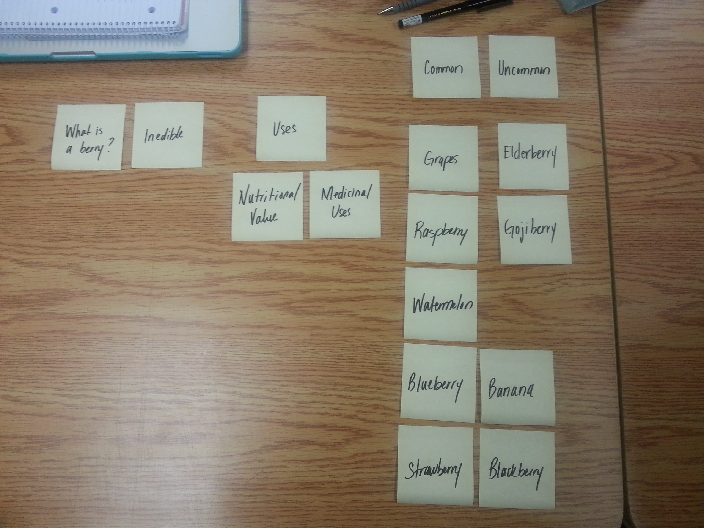
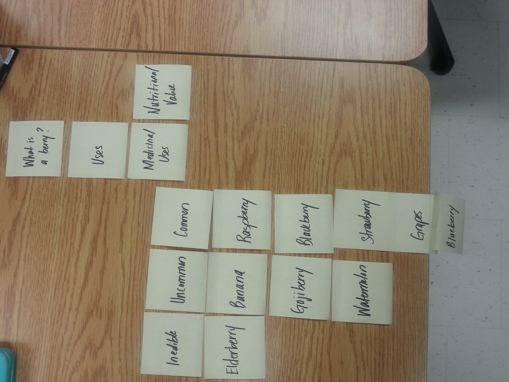

# Card sort report

The purpose of this card sort was to determine common navigation patterns and categories from the content of Berries

## Specifics

The card sort was conducted by Keisha Chamberlain on Thursday, September 10th, 2013 between the times of 8:00 AM and 11:00 AM with the following participants:

- Kelly Seay
- James Gollner
- Steve Donegani

### Cards

16 cards were used covering a broad range of applicable content for the website. The following topics were used as cards:

1. Elderberry (Sambucus)
2. Banana
3. Blueberry
4. Grape
5. Gojiberry
6. Strawberry
7. Blackberry
8. Raspberry
9. Watermelon
10. Nutritional Value
11. Uses
12. Uncommon
13. Common
14. Inedible
15. Medicinal Uses

## Card sort results

*Card sort 1 by Kelly Seay*

*Card sort 2 by Steve Donegoni*

*Card sort 3 by James Gollner*

## Observations

- Did the participants have any common comments?
	- Make nutritional value and medicinal uses a sub-category of Uses
	- Maybe the inedible category should be a sub-topic of uncommon
- Did they have questions that stood out?
	- "Which fruits are actually inedible?"  
- Did they struggle with certain articles or topics?
	- They struggled with figuring out which of  the berries were inedible/uncommon or commmon without research	 .
- Did they find common groupings? Or were the groupings completely different?
	- The groupings were the same except for the the last grouping.
- Were some of the groupings completely unexpected?
	- None of the groupings were unexpected because it was along the lines of what I had in mind; however, they were all unique.
- Were the results similar to your expectations?
	- Yes, they all were.
- How did you feel while watching them perform the task?
	- Excited
	- Anxious
	- Nervous