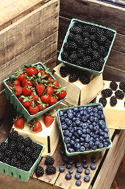

# Berries

## Modified berries

The fruit of citrus, such as the orange, kumquat and lemon, is a berry with a thick rind and a very juicy interior that is given the special name hesperidium.
Berries which develop from an inferior ovary are sometimes termed epigynous berries or false berries, as opposed to true berries which develop from a superior ovary. In epigynous berries, the berry includes tissue derived from parts of the flower besides the ovary. 

The floral tube, formed from the basal part of the sepals, petals and stamens can become fleshy at maturity and is united with the ovary to form the fruit. Common fruits that are sometimes classified as epigynous berries include bananas, coffee, members of the genus Vaccinium (e.g., cranberries and blueberries), and members of the family Cucurbitaceae (e.g., cucumbers, melons and squash).[2]

Another specialized term is also used for Cucurbitaceae fruits, which are modified to have a hard outer rind, and are given the special name pepo. While pepos are most common in the Cucurbitaceae, the fruits of Passiflora and Carica are sometimes also considered pepos.[3]

## Fruits not botanical berries

Several types of common "berries" are shown, only one of which (the blueberry) is a berry by botanical definition. Blackberries are aggregate fruit composed of many drupelets, and strawberries are aggregate accessory fruit.
Many fruits commonly referred to as berries are not actual berries by the scientific definition, but fall into one of the following categories:

### Pomes
The pome fruits produced by plants in subtribe Pyrinae of family Rosaceae, such as apples and pears, have a structure (the core) that clearly separates the seeds from the ovary tissue. However, some of the smaller pomes are sometimes referred to as berries. Bright red haws from Crataegus are sometimes called hawberries. Amelanchier pomes become so soft at maturity that they resemble a blueberry and are known as Juneberries or Saskatoon berries.

### Drupes
Drupes are fleshy fruits produced from a (usually) single-seeded ovary with a hard stony layer (called the endocarp) surrounding the seed.

- Olive
- Plum
- Peach
- Cherry
- Hackberry (Celtis spp.; Cannabaceae)
- Bayberry

Other drupe-like fruits with a single seed, that lack the stony endocarp include Sea-buckthorn (Hippophae rhamnoides, Elaeagnaceae), an achene surrounded by the swollen hypanthium, which provides the fleshy layer.

### Multiple fruits

Multiple fruits include the fruits of multiple flowers that are merged or packed closely together. The mulberry is a berry-like example of a multiple fruit; it develops from a cluster of tiny separate flowers that become compressed as they develop into fruit.[4]

